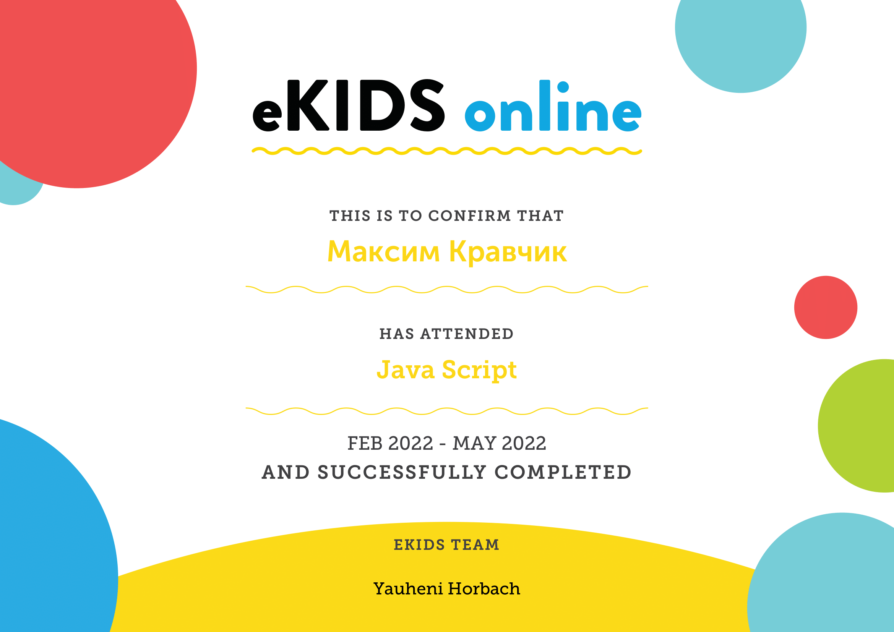
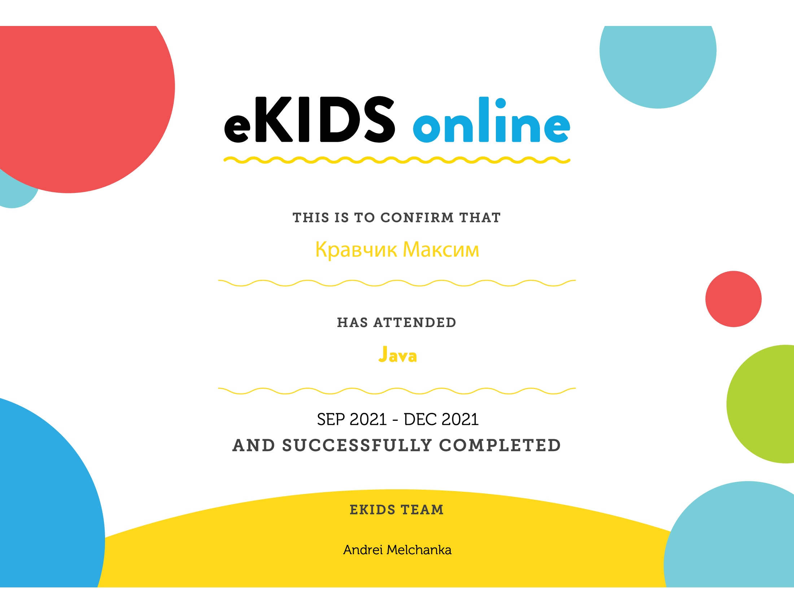
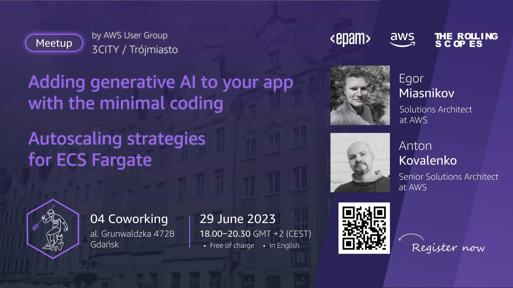

# Maxim Krauchyk
## Junior Frontend/Python Developer
***
### Contacts:

 

***
### About myself:
My name is `Max`. I am `16` years old. I am from the city of Grodno. My goal is to become a programmer👨‍💻 and work in the IT company `EPAM`. I study at `Gymnasium №2`, with a focus on English. My teacher and my classmates and I win various competitions in both the English and IT fields. I am very passionate about `web development, application development, game development, and also design.`

__I believe that all my endeavors will come true and I will achieve success🎉 and great heights 🎂 in the world of IT.💻😁__
ㅤㅤㅤㅤㅤㅤㅤㅤㅤㅤㅤㅤㅤㅤㅤㅤㅤㅤㅤㅤㅤㅤㅤ
> __`Success is when you fall nine times but get up ten.`__
ㅤㅤㅤㅤㅤㅤㅤㅤㅤㅤㅤㅤㅤㅤㅤㅤㅤㅤㅤㅤㅤㅤㅤㅤㅤㅤㅤㅤㅤㅤㅤㅤㅤㅤㅤㅤㅤㅤㅤ `U. Churchil`
### Skills:
 * _HTML, CSS_
 * _JavaScript Basics , Python_
 *  _Github, Git_
 * _VS Code, InteliJ Idea, PyCharm_
 * _Figma,  Adobe Ilustrator , Canva_

***

### Code Example:
    function multiply(a, b) {
    return a * b
    }

***
### Courses:
* __JavaScript Epam Kids (completed)__

* __Java Epam Kids (completed)__

* __Rolling Scopes JavaScript Stage#0 (in progress)__

***
### Meetings:
* __Amazon Web Services User Group 3city Meetup__

***

### Projects(Python):
#### Telegram Bots
* [_Levelizer_](https://t.me/LevelizerBot) __(English Bot(❗️First Place in the IT-Master 2023 Contest❗️))__
* [_KravchenskiBot_](https://t.me/KravchenskiBot) (__My personal bot with multiple projects in it.__)

***
### Languages:
* English - Intermediate
* Russian, Belarusian - Native
* Polish - Intermediate