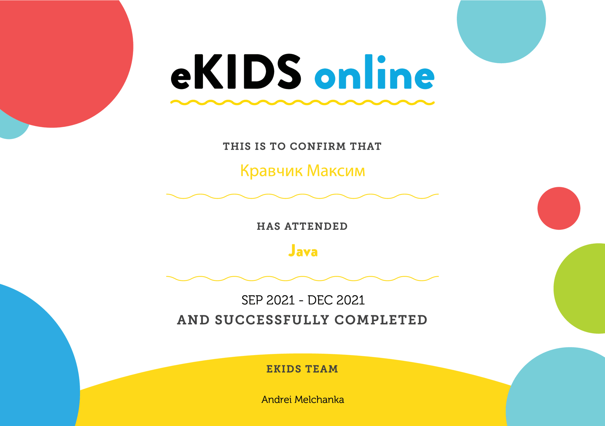

# Maxim Krauchyk
## Junior Frontend/Python Developer
***
### Contacts:

 
***
### About myself:
__My name is__ `Max`. I am `16` years old. I am from `Grodno`. My goal is to become a developer👨‍💻 and to work in the `international IT company🏢`. I study at `Gymnasium №2`, with intensive learning of English language. Thanks to my knowledge of English, I can easily read documentation, communicate with another people.

__Although__  I have a deep passion for learning and exploring new ideas. I actively participate in various competitions where I can show my `English` and `IT` skills. Due to the fact that I study a lot I have a certain result: __`First Place in the IT-Master 2023 Contest.`__

<!-- ___web development, create applications, game development, and design.___ -->

__In terms of technical skills__, I have a solid foundation in `HTML`, `CSS`,`Java` and `JavaScript`. I also have knowledge in `Python` which allows me to create various projects: `chatbots in Telegram`. I constantly use `GitHub` to save my projects. Additionally, I am proficient in utilizing `Git` _for version control_, and I am familiar with popular _development tools_ such as `VS Code`, `IntelliJ IDEA`, and `PyCharm`. Furthermore, I have experience working with _design tools_ 🎨 such as `Figma`, `Adobe Illustrator`, and `Canva`, enabling me to create visually appealing _interfaces_, _presentations_ and _beautiful slide-shows_.

Last year I started using `ChatGPT` and finding out the latest news📰 about `neural networks`. It helps me to find the necessary information when I create projects very quickly.

__With a strong drive for self-improvement and passion for programming🖥️🖱️ and  neural networks🤖, I am excited to embark on this journey🚢 to achieve my goals🎯 in the IT industry💻.__

***
### Skills:
 * _HTML, CSS_
 * _JavaScript Basics , Python_
 *  _Github, Git_
 * _VS Code, InteliJ Idea, PyCharm_
 * _Figma,  Adobe Ilustrator , Canva_

***

### Code Example:
    function multiply(a, b){
    return a * b  
    }

***
### Courses:
* __JavaScript Epam Kids (completed)__

* __Java Epam Kids (completed)__

* __Rolling Scopes JavaScript Stage#0 (in progress)__

***
### Meetings:
* __Amazon Web Services User Group 3city Meetup__

***

### Projects(Python):
#### Telegram Bots
* [_Levelizer_](https://t.me/LevelizerBot) __(English Bot(❗️First Place in the IT-Master 2023 Contest❗️))__
* [_KravchenskiBot_](https://t.me/KravchenskiBot) (__My personal bot with multiple projects in it.__)

***
### Languages:
* English - Intermediate
* Russian, Belarusian - Native
* Polish - Intermediate